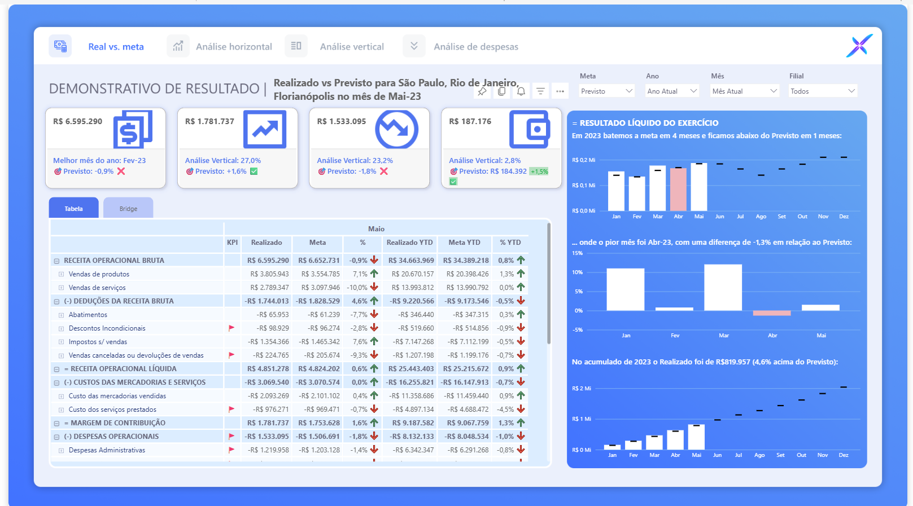

# 📊 Dashboard de DRE Gerencial | Controladoria

Dashboard desenvolvido em **Power BI** com foco no acompanhamento do desempenho financeiro e análise gerencial de uma Demonstração do Resultado do Exercício (DRE).

🎯 Objetivo

O projeto tem como objetivo proporcionar uma visão gerencial do desempenho financeiro, permitindo comparar os valores **Realizados vs. Previstos**, identificar desvios e acompanhar a evolução dos principais indicadores financeiros.

📌 Principais análises

- Realizado vs. Previsto
- Análise vertical
- Análise de desvios
- Receita Operacional Bruta
- Receita Operacional Líquida
- Margem de Contribuição
- Despesas Operacionais
- Resultado Líquido
- Análise acumulada (YTD)
- Evolução mensal do resultado

## 🛠️ Tecnologias utilizadas

- Power BI
- DAX
- Power Query
- Modelagem de dados
- Excel

## 📊 Dashboard

## 📈 Indicadores apresentados

O dashboard permite acompanhar os principais indicadores financeiros da operação, incluindo:

| Indicador | Análise |
|---|---|
| Receita Operacional Bruta | Realizado vs. Previsto |
| Receita Operacional Líquida | Evolução e variação |
| Margem de Contribuição | Análise mensal e acumulada |
| Despesas Operacionais | Comparação com o previsto |
| Resultado Líquido | Evolução mensal |
| YTD | Realizado vs. Previsto acumulado |

## 💡 Recursos desenvolvidos

O projeto utiliza recursos do Power BI para transformar dados financeiros em informações gerenciais, incluindo:

- Medidas DAX;
- Indicadores de desempenho;
- Comparações mensais;
- Análise acumulada;
- Formatação condicional;
- Indicadores visuais de desempenho;
- Storytelling de dados.

## 👨‍💻 Autor

**Matheus Amaral**

[LinkedIn](https://www.linkedin.com/in/matheusferreiradoamaral/)

[GitHub](https://github.com/MatheusAmaraal)
